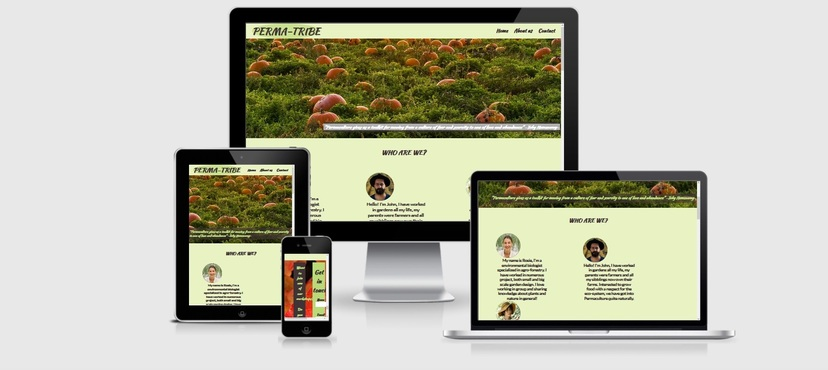

<h1>Perma-tribe</h1>

Perma-Tribe is a wesite for all permaculture lovers that want to learn more about it but also beginners that would like to understand the core concept. They can decide to participate into some workshop or just see what the other people do.

<h2>Features:</h2>
Navigation Bar
-Features an easy navigation to the different sections of the website.

-The first view on the site display an hero-image that represent the abundance of food that someone could get from following the permaculture principles, with a quote that qualify it.

-The About us section present the member of this association to the user, help him to feel welcome.
-It also shows that the members are qualified to teach about the subject.

-The What is Permaculture section gives a short but meaningfull definition of the subject, as a presentation or a reminder for the users who already knew a bit about the subject.

-The Our workshop section is a presentation to the user of what is actually gonna be happening in the events presented by the website. It will hopefully convince the user to join in!

-The Contact Us section displays a contact form to give the possibility to the user of making a step towards join the workshop proposed by the members.

-The footer section includes links to social medias where the user can also get to know more about the members this association.

<h2>Responsivity</h2>

<h2>Testing</h2>
-HTML
 .No errors were returned when passing through the official W3C validator

 -CSS
 .No errors were found when passing through the official (Jigsaw) validator

 <h2>Unfixed Bugs</h2>

 The website is unfortunately not responsive due to a lack of time and skills from the developer.

 <h2>Deployment</h2>

    The site was deployed to GitHub pages. The steps to deploy are as follows:
        In the GitHub repository, navigate to the Settings tab
        From the source section drop-down menu, select the Master Branch
        Once the master branch has been selected, the page will be automatically refreshed with a detailed ribbon display to indicate the successful deployment.

The live link can be found here - https://will-dml.github.io/Milestone1/

Credit

All images has been found on free stock photo website (Pexels and Pixabay)

